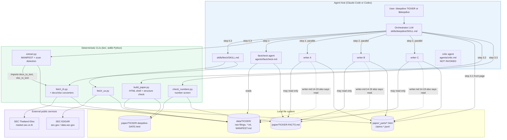

# Component architecture

Source: [ARCHITECTURE.md](../ARCHITECTURE.md)

## Mermaid source

```mermaid
graph TD
    subgraph Host["Agent host (Claude Code or Codex)"]
        U[User: /deepdive TICKER or $deepdive]
        ORCH[Orchestrator LLM<br/>skills/deepdive/SKILL.md]
        FSK[skills/fetch/SKILL.md]
        FC[factcheck agent<br/>agents/factcheck.md]
        W1[writer A]
        W2[writer B]
        W3[writer C]
        CR[critic agent<br/>agents/critic.md<br/>NOT INVOKED]
    end

    subgraph Scripts["Deterministic CLIs (bin/, stdlib Python)"]
        FUS[fetch_us.py]
        FTH[fetch_th.py<br/>+ docx/xlsx converters]
        EXT[extract.py<br/>MANIFEST + scan detection]
        BLD[build_paper.py<br/>HTML shell + structure check]
        CHK[check_numbers.py<br/>number screen]
    end

    subgraph FS["Local file system"]
        DATA[(data/TICKER/<br/>raw filings, *.txt, MANIFEST.md)]
        FACTS[(paper/TICKER-FACTS.md)]
        PARTS[(paper/_parts/*.html<br/>claims-*.jsonl)]
        OUT[(paper/TICKER-deepdive-DATE.html)]
    end

    subgraph Ext["External public services"]
        EDGAR[SEC EDGAR<br/>sec.gov / data.sec.gov]
        IDISC[SEC Thailand iDisc<br/>market.sec.or.th]
    end

    U --> ORCH
    ORCH -->|step 0.2| FSK
    FSK --> FUS
    FSK --> FTH
    FUS --> EDGAR
    FTH --> IDISC
    FUS --> DATA
    FTH --> DATA
    ORCH -->|step 0.3| EXT
    EXT -->|imports docx_to_text, xlsx_to_text| FTH
    EXT --> DATA
    ORCH -->|step 1| FC
    FC -->|reads| DATA
    FC --> FACTS
    ORCH -->|step 2, parallel| W1 & W2 & W3
    W1 & W2 & W3 -->|may read only| FACTS
    W1 & W2 & W3 -.->|writer.md:14-19 also says read| DATA
    W1 & W2 & W3 --> PARTS
    ORCH -->|step 3.1 front page| PARTS
    ORCH -->|step 3.2| BLD
    BLD --> PARTS
    BLD --> OUT
    ORCH -->|step 3.3| CHK
    CHK --> OUT
    CHK --> FACTS

    style CR stroke-dasharray: 5 5
    style Ext fill:#f3eefe,stroke:#7c5cd6
    style Scripts fill:#eafaf1,stroke:#2f9e62
    style Host fill:#eaf4fd,stroke:#2b7bbf
```
