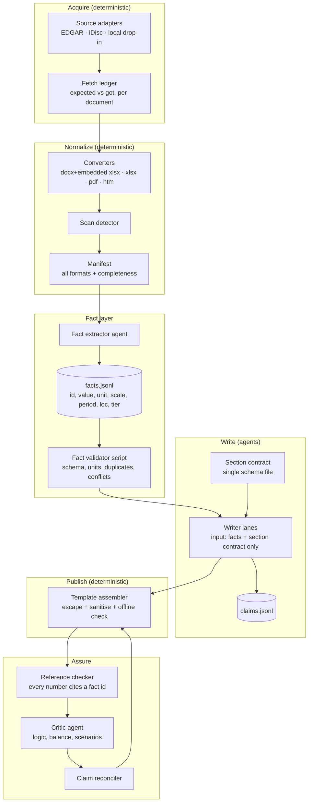

# Clean-room target architecture

Source: [REIMPLEMENTATION_BLUEPRINT.md](../REIMPLEMENTATION_BLUEPRINT.md)

## Mermaid source

```mermaid
graph TD
    subgraph Acquire["Acquire (deterministic)"]
        SRC[Source adapters<br/>EDGAR · iDisc · local drop-in]
        STAT[Fetch ledger<br/>expected vs got, per document]
    end
    subgraph Normalize["Normalize (deterministic)"]
        CONV[Converters<br/>docx+embedded xlsx · xlsx · pdf · htm]
        SCAN[Scan detector]
        MAN[Manifest<br/>all formats + completeness]
    end
    subgraph Facts["Fact layer"]
        FX[Fact extractor agent]
        FDB[(facts.jsonl<br/>id, value, unit, scale, period, loc, tier)]
        FV[Fact validator script<br/>schema, units, duplicates, conflicts]
    end
    subgraph Write["Write (agents)"]
        PLAN[Section contract<br/>single schema file]
        W[Writer lanes<br/>input: facts + section contract only]
        CL[(claims.jsonl)]
    end
    subgraph Assure["Assure"]
        REF[Reference checker<br/>every number cites a fact id]
        CR[Critic agent<br/>logic, balance, scenarios]
        REC[Claim reconciler]
    end
    subgraph Publish["Publish (deterministic)"]
        TPL[Template assembler<br/>escape + sanitise + offline check]
    end

    SRC --> STAT --> CONV --> SCAN --> MAN
    MAN --> FX --> FDB --> FV
    FV --> W
    PLAN --> W
    W --> CL
    W --> TPL
    TPL --> REF
    REF --> CR --> REC --> TPL
```
