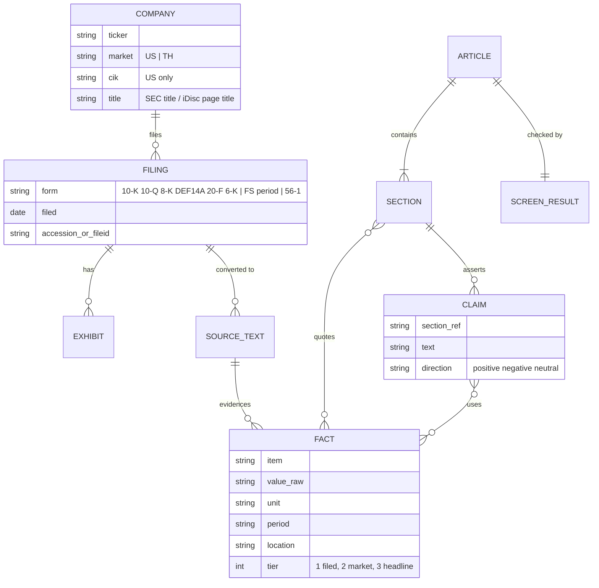

# Domain entities

Source: [DATA_MODELS.md](../DATA_MODELS.md)

## Mermaid source

```mermaid
erDiagram
    COMPANY ||--o{ FILING : files
    COMPANY {
        string ticker
        string market "US | TH"
        string cik "US only"
        string title "SEC title / iDisc page title"
    }
    FILING ||--o{ EXHIBIT : has
    FILING {
        string form "10-K 10-Q 8-K DEF14A 20-F 6-K | FS period | 56-1"
        date filed
        string accession_or_fileid
    }
    FILING ||--o{ SOURCE_TEXT : "converted to"
    SOURCE_TEXT ||--o{ FACT : "evidences"
    FACT {
        string item
        string value_raw
        string unit
        string period
        string location
        int tier "1 filed, 2 market, 3 headline"
    }
    ARTICLE ||--|{ SECTION : contains
    SECTION }o--o{ FACT : quotes
    SECTION ||--o{ CLAIM : asserts
    CLAIM {
        string section_ref
        string text
        string direction "positive negative neutral"
    }
    CLAIM }o--o{ FACT : uses
    ARTICLE ||--|| SCREEN_RESULT : "checked by"
```
