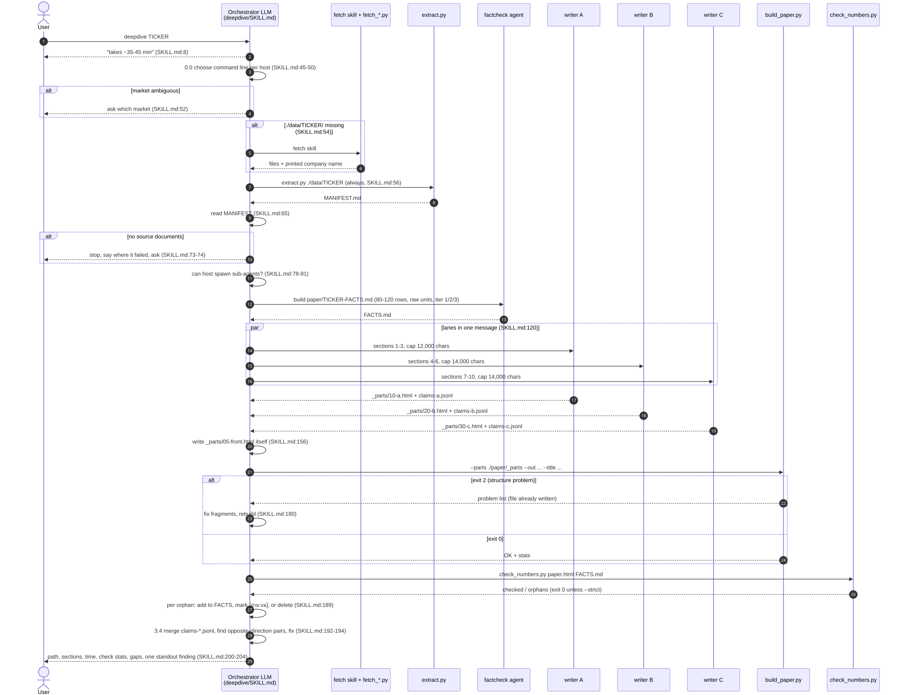
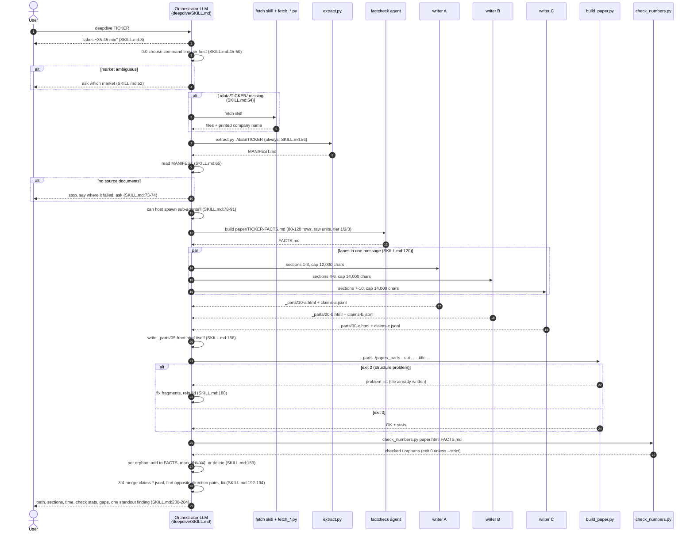

# Flow F1: /deepdive end to end

Source: [EXECUTION_FLOWS.md](../EXECUTION_FLOWS.md)

## Mermaid source

```mermaid
sequenceDiagram
    autonumber
    actor User
    participant O as Orchestrator LLM<br/>(deepdive/SKILL.md)
    participant F as fetch skill + fetch_*.py
    participant X as extract.py
    participant FC as factcheck agent
    participant WA as writer A
    participant WB as writer B
    participant WC as writer C
    participant B as build_paper.py
    participant C as check_numbers.py

    User->>O: deepdive TICKER
    O-->>User: "takes ~35-45 min" (SKILL.md:8)
    O->>O: 0.0 choose command line per host (SKILL.md:45-50)
    alt market ambiguous
        O-->>User: ask which market (SKILL.md:52)
    end
    alt ./data/TICKER/ missing (SKILL.md:54)
        O->>F: fetch skill
        F-->>O: files + printed company name
    end
    O->>X: extract.py ./data/TICKER (always, SKILL.md:56)
    X-->>O: MANIFEST.md
    O->>O: read MANIFEST (SKILL.md:65)
    alt no source documents
        O-->>User: stop, say where it failed, ask (SKILL.md:73-74)
    end
    O->>O: can host spawn sub-agents? (SKILL.md:78-91)
    O->>FC: build paper/TICKER-FACTS.md (80-120 rows, raw units, tier 1/2/3)
    FC-->>O: FACTS.md
    par lanes in one message (SKILL.md:120)
        O->>WA: sections 1-3, cap 12,000 chars
        O->>WB: sections 4-6, cap 14,000 chars
        O->>WC: sections 7-10, cap 14,000 chars
    end
    WA-->>O: _parts/10-a.html + claims-a.jsonl
    WB-->>O: _parts/20-b.html + claims-b.jsonl
    WC-->>O: _parts/30-c.html + claims-c.jsonl
    O->>O: write _parts/05-front.html itself (SKILL.md:156)
    O->>B: --parts ./paper/_parts --out ... --title ...
    alt exit 2 (structure problem)
        B-->>O: problem list (file already written)
        O->>O: fix fragments, rebuild (SKILL.md:180)
    else exit 0
        B-->>O: OK + stats
    end
    O->>C: check_numbers.py paper.html FACTS.md
    C-->>O: checked / orphans (exit 0 unless --strict)
    O->>O: per orphan: add to FACTS, mark [คำนวณ], or delete (SKILL.md:189)
    O->>O: 3.4 merge claims-*.jsonl, find opposite-direction pairs, fix (SKILL.md:192-194)
    O-->>User: path, sections, time, check stats, gaps, one standout finding (SKILL.md:200-204)
```
