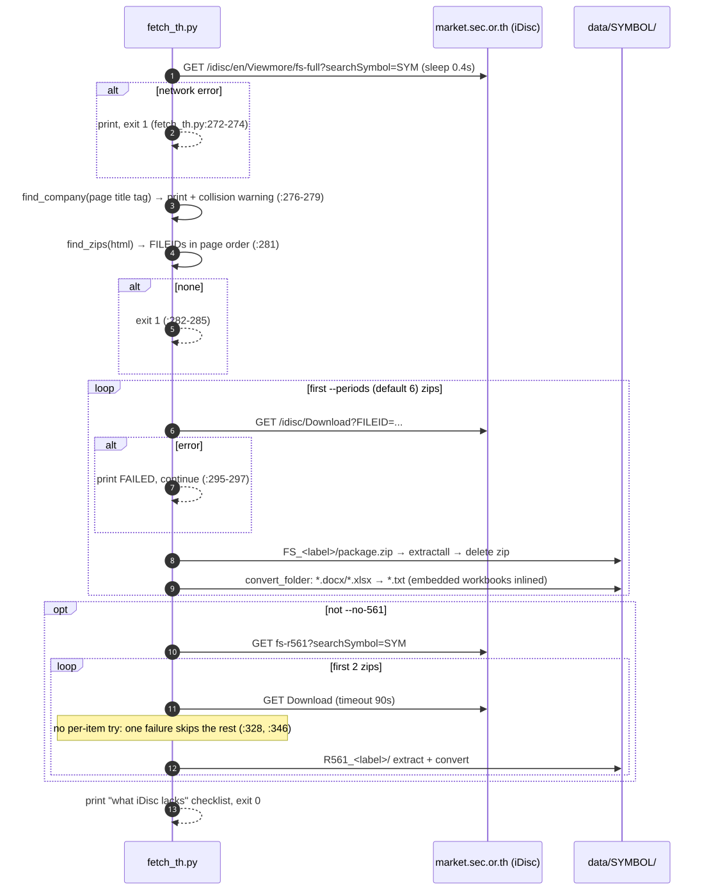
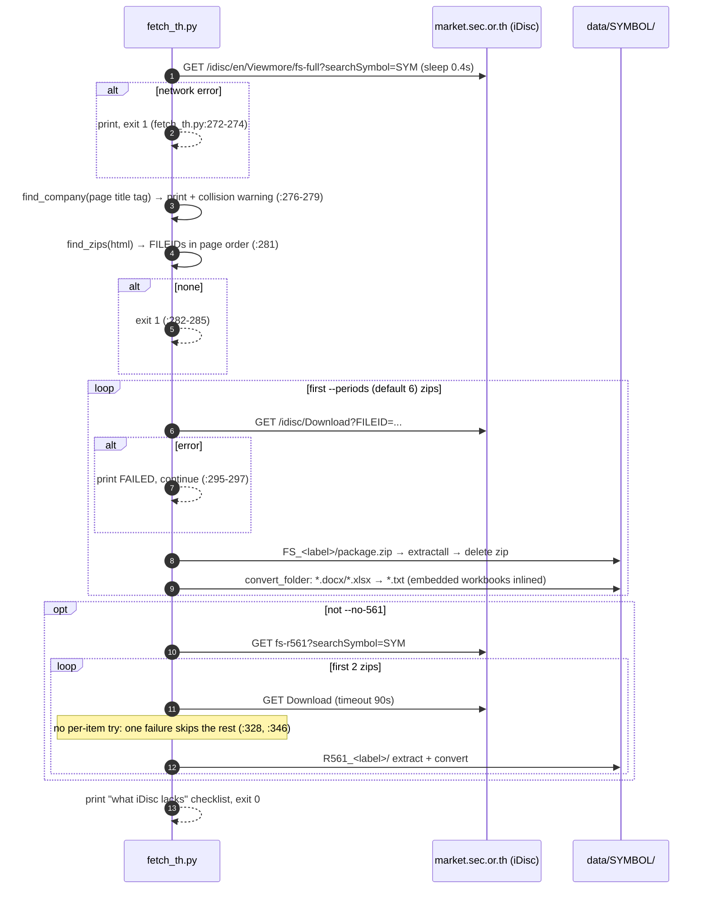

# Flow F2: fetch_th.py (iDisc)

Source: [EXECUTION_FLOWS.md](../EXECUTION_FLOWS.md)

## Mermaid source

```mermaid
sequenceDiagram
    autonumber
    participant CLI as fetch_th.py
    participant ID as market.sec.or.th (iDisc)
    participant FS as data/SYMBOL/

    CLI->>ID: GET /idisc/en/Viewmore/fs-full?searchSymbol=SYM (sleep 0.4s)
    alt network error
        CLI-->>CLI: print, exit 1 (fetch_th.py:272-274)
    end
    CLI->>CLI: find_company(page title tag) → print + collision warning (:276-279)
    CLI->>CLI: find_zips(html) → FILEIDs in page order (:281)
    alt none
        CLI-->>CLI: exit 1 (:282-285)
    end
    loop first --periods (default 6) zips
        CLI->>ID: GET /idisc/Download?FILEID=...
        alt error
            CLI-->>CLI: print FAILED, continue (:295-297)
        end
        CLI->>FS: FS_<label>/package.zip → extractall → delete zip
        CLI->>FS: convert_folder: *.docx/*.xlsx → *.txt (embedded workbooks inlined)
    end
    opt not --no-561
        CLI->>ID: GET fs-r561?searchSymbol=SYM
        loop first 2 zips
            CLI->>ID: GET Download (timeout 90s)
            Note over CLI: no per-item try: one failure skips the rest (:328, :346)
            CLI->>FS: R561_<label>/ extract + convert
        end
    end
    CLI-->>CLI: print "what iDisc lacks" checklist, exit 0
```
