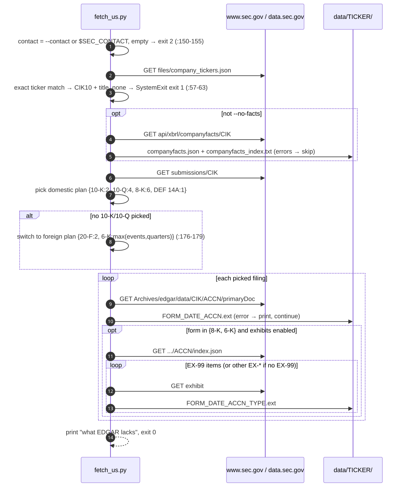
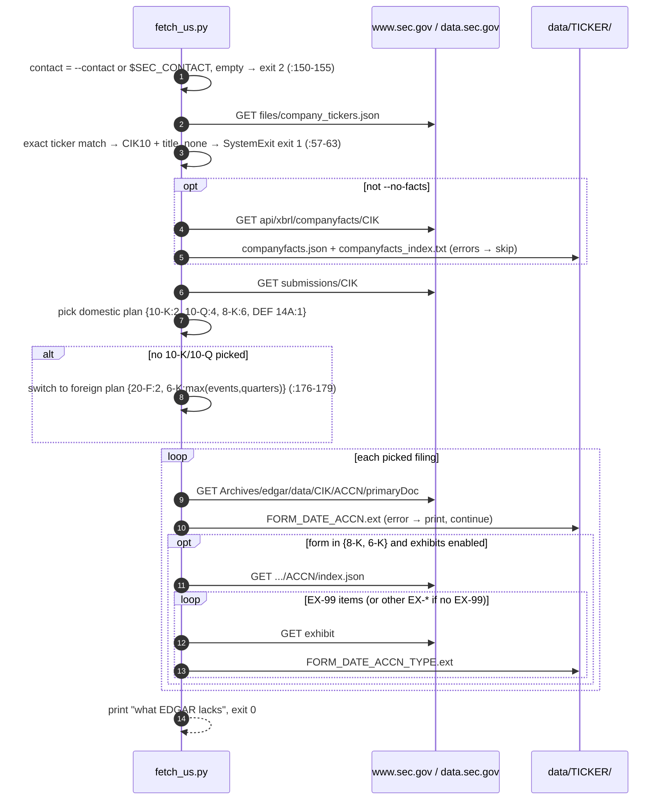

# Flow F3: fetch_us.py (EDGAR)

Source: [EXECUTION_FLOWS.md](../EXECUTION_FLOWS.md)

## Mermaid source

```mermaid
sequenceDiagram
    autonumber
    participant CLI as fetch_us.py
    participant SEC as www.sec.gov / data.sec.gov
    participant FS as data/TICKER/

    CLI->>CLI: contact = --contact or $SEC_CONTACT, empty → exit 2 (:150-155)
    CLI->>SEC: GET files/company_tickers.json
    CLI->>CLI: exact ticker match → CIK10 + title, none → SystemExit exit 1 (:57-63)
    opt not --no-facts
        CLI->>SEC: GET api/xbrl/companyfacts/CIK##########.json
        CLI->>FS: companyfacts.json + companyfacts_index.txt (errors → skip)
    end
    CLI->>SEC: GET submissions/CIK##########.json
    CLI->>CLI: pick domestic plan {10-K:2, 10-Q:4, 8-K:6, DEF 14A:1}
    alt no 10-K/10-Q picked
        CLI->>CLI: switch to foreign plan {20-F:2, 6-K:max(events,quarters)} (:176-179)
    end
    loop each picked filing
        CLI->>SEC: GET Archives/edgar/data/CIK/ACCN/primaryDoc
        CLI->>FS: FORM_DATE_ACCN.ext (error → print, continue)
        opt form in {8-K, 6-K} and exhibits enabled
            CLI->>SEC: GET .../ACCN/index.json
            loop EX-99 items (or other EX-* if no EX-99)
                CLI->>SEC: GET exhibit
                CLI->>FS: FORM_DATE_ACCN_TYPE.ext
            end
        end
    end
    CLI-->>CLI: print "what EDGAR lacks", exit 0
```
