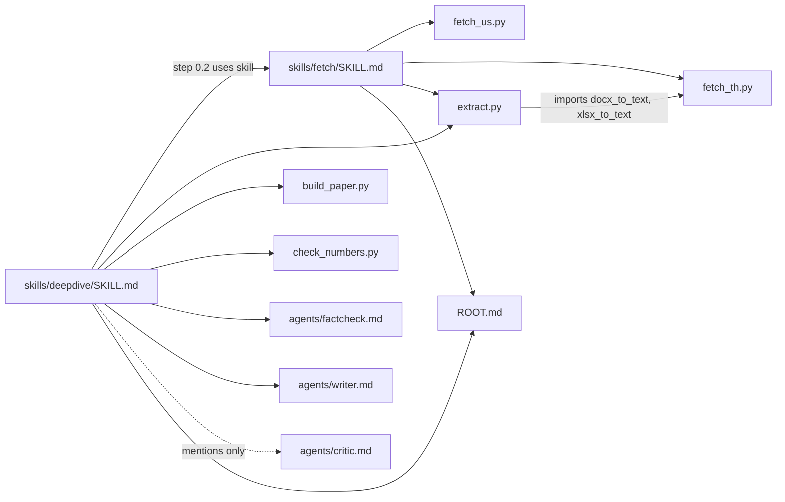

# Module dependencies

Source: [ARCHITECTURE.md](../ARCHITECTURE.md)

## Mermaid source

```mermaid
graph LR
    EXT[extract.py] -->|imports docx_to_text, xlsx_to_text| FTH[fetch_th.py]
    DSK[skills/deepdive/SKILL.md] -->|step 0.2 uses skill| FSK[skills/fetch/SKILL.md]
    DSK --> EXT
    DSK --> BLD[build_paper.py]
    DSK --> CHK[check_numbers.py]
    DSK --> FCA[agents/factcheck.md]
    DSK --> WRA[agents/writer.md]
    DSK -. mentions only .-> CRA[agents/critic.md]
    FSK --> FUS[fetch_us.py]
    FSK --> FTH
    FSK --> EXT
    DSK --> ROOT[ROOT.md]
    FSK --> ROOT
```
