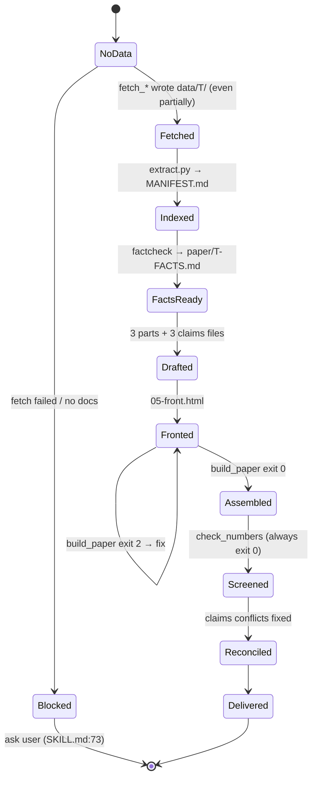

# Implicit run state machine

Source: [EXECUTION_FLOWS.md](../EXECUTION_FLOWS.md)

## Mermaid source

```mermaid
stateDiagram-v2
    [*] --> NoData
    NoData --> Fetched: fetch_* wrote data/T/ (even partially)
    NoData --> Blocked: fetch failed / no docs
    Blocked --> [*]: ask user (SKILL.md:73)
    Fetched --> Indexed: extract.py → MANIFEST.md
    Indexed --> FactsReady: factcheck → paper/T-FACTS.md
    FactsReady --> Drafted: 3 parts + 3 claims files
    Drafted --> Fronted: 05-front.html
    Fronted --> Assembled: build_paper exit 0
    Fronted --> Fronted: build_paper exit 2 → fix
    Assembled --> Screened: check_numbers (always exit 0)
    Screened --> Reconciled: claims conflicts fixed
    Reconciled --> Delivered
    Delivered --> [*]
```
